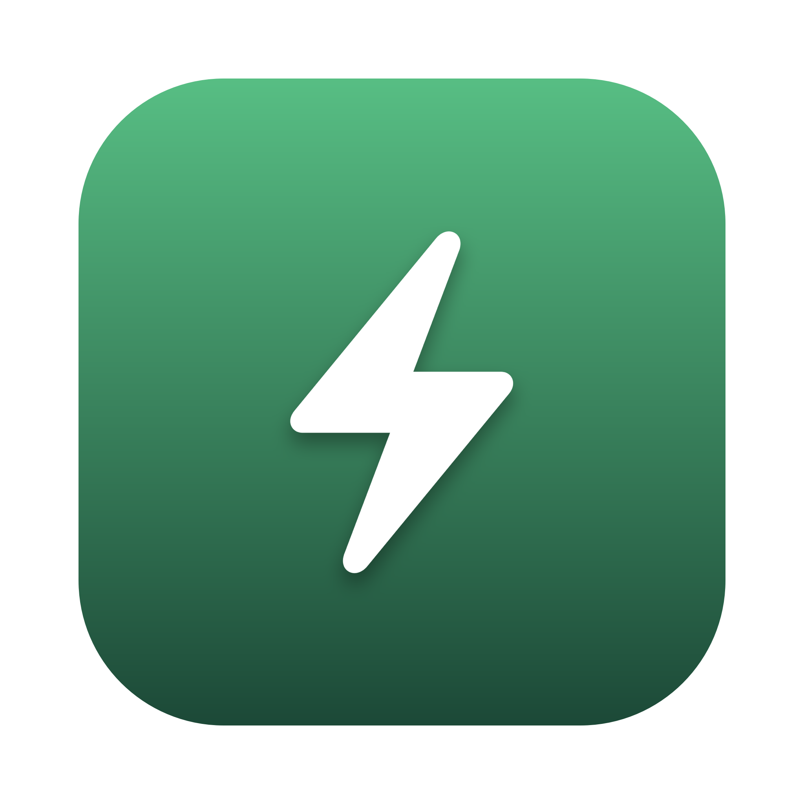
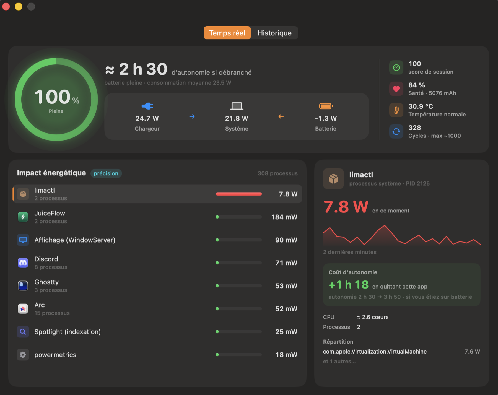

<p align="center">
  
</p>

<h1 align="center">JuiceFlow</h1>

<p align="center">
  <b>The macOS energy monitor that speaks in minutes of battery life — not percentages.</b>
</p>

<p align="center">
  
  
  
  <a href="LICENSE"></a>
  <a href="https://github.com/imadhy/juice-flow/actions/workflows/ci.yml"></a>
</p>

<p align="center">
  
</p>

Activity Monitor tells you an app has an *energy impact of 47*. JuiceFlow tells you what that actually means: **quit it and get 38 more minutes of battery.**

> 🇫🇷 The app UI is currently in French. Localization would be a fantastic first contribution — see [Contributing](#contributing).

## Features

- **Battery time as the hero metric** — the gauge shows *how long you have left*, computed from the real remaining energy (mAh × voltage) and a 2-minute rolling average of your actual drain. No jumpy estimates.
- **Live power flow** — watts flowing from charger → Mac → battery in real time, read from SMC sensors (the same source as iStat Menus). Watch the battery chip in when your charger can't keep up.
- **Real watts per app** — precision mode streams `powermetrics` (Apple's own measurement tool): P/E-core-aware energy, GPU, and the processes nothing else shows you (WindowServer, kernel). Helpers are grouped under their parent app, exactly like Activity Monitor does.
- **Autonomy cost** — the signature feature: select any app and see *“+1 h 03 by quitting this app — 2 h 30 → 3 h 33”*.
- **A discreet bodyguard** — 🔥 runaway and 🌙 background-heavy badges, and (on battery only) actionable notifications with a **Quit** button and the estimated minutes you'd win. Snooze and sensitivity settings included.
- **History** — battery curve over 24 h, energy consumed per app per day, day-over-day comparison. Plain SQLite, 30/90-day retention.
- **Menu bar companion** — your live drain in watts (the number macOS never shows you), top 5 hungry apps, one click from anywhere.
- **It practices what it preaches** — JuiceFlow measures itself in its own ranking: ~200 mW with the dashboard open, virtually invisible when closed (the measurement stream slows to one sample / 30 s).

## Install

### Build from source (recommended — no Xcode needed)

All you need is [Command Line Tools](https://developer.apple.com/download/all/) (`xcode-select --install`):

```sh
git clone https://github.com/imadhy/juice-flow.git
cd juice-flow
./scripts/bundle.sh   # builds, signs (ad-hoc) and launches JuiceFlow.app
```

The bundle ends up in `build/JuiceFlow.app` — drag it to `/Applications` if you like it.

### Download the .dmg

Grab the latest release from [Releases](https://github.com/imadhy/juice-flow/releases). The app is **not notarized** (this is an unsigned open source project — no Apple Developer subscription): on first launch macOS will refuse to open it. Either:

- **System Settings → Privacy & Security → “Open Anyway”**, or
- clear the quarantine flag yourself: `xattr -cr /Applications/JuiceFlow.app`

## Precision mode & security

JuiceFlow works out of the box with no privileges (per-app impact estimated from CPU deltas, Activity-Monitor style). For **real watts**, it needs `powermetrics`, which requires root. Instead of shipping an opaque root daemon, JuiceFlow installs **one auditable line**:

```
<your-user> ALL=(root) NOPASSWD: /usr/bin/powermetrics
```

- written to `/etc/sudoers.d/juiceflow-powermetrics` after **your explicit consent** (native admin prompt),
- validated with `visudo` (and deleted if invalid),
- scoped to a single read-only Apple diagnostics binary, for your user only,
- removable at any time from the app's Settings, or with `sudo rm /etc/sudoers.d/juiceflow-powermetrics`.

You can audit the whole mechanism in [`PowerMetricsService.swift`](Sources/JuiceFlow/PowerMetrics/PowerMetricsService.swift). A signed `SMAppService` daemon would be the canonical alternative, but it only makes sense for notarized distribution.

## How it works

| Data | Source | Privileges |
|---|---|---|
| Charge %, health, cycles, temperature | IOKit `AppleSmartBattery` registry | none |
| Live watts (battery / system / charger) | SMC keys `PPBR` / `PSTR` / `PDTR` | none |
| Per-app power (precision) | `powermetrics --samplers tasks` (mW, P/E-aware) | sudoers rule |
| Per-app impact (fallback) | `libproc` CPU deltas + responsible-PID grouping | none |
| Autonomy model | remaining Wh ÷ 2-min rolling drain average | none |
| History | SQLite (WAL) in `~/Library/Application Support/JuiceFlow/` | none |

Built with SwiftUI + Swift 6 strict concurrency, and compiled with **Swift Package Manager only** — the absence of Xcode shaped the whole architecture (hand-rolled app bundling, SQLite instead of SwiftData, the app icon is generated by code).

## CLI diagnostics

The binary doubles as a diagnostic tool:

```sh
.build/debug/JuiceFlow --dump      # battery + SMC + autonomy readings
.build/debug/JuiceFlow --top [s]   # estimation-mode ranking (cross-check with `top`)
.build/debug/JuiceFlow --pm [s]    # powermetrics parsing + JuiceFlow's own consumption
```

## Roadmap

- [ ] English / localized UI
- [ ] Homebrew tap
- [ ] Weekly digest (“your energy, wrapped”)
- [ ] Charge coach (80 % limit insights, undersized-charger detection)
- [ ] Signed builds + `SMAppService` daemon (needs sponsoring an Apple Developer membership)

## Contributing

See [CONTRIBUTING.md](CONTRIBUTING.md). Good first issues: UI localization, new daemon glyphs, threshold tuning.

## License

[MIT](LICENSE) © Imad El Hitti
